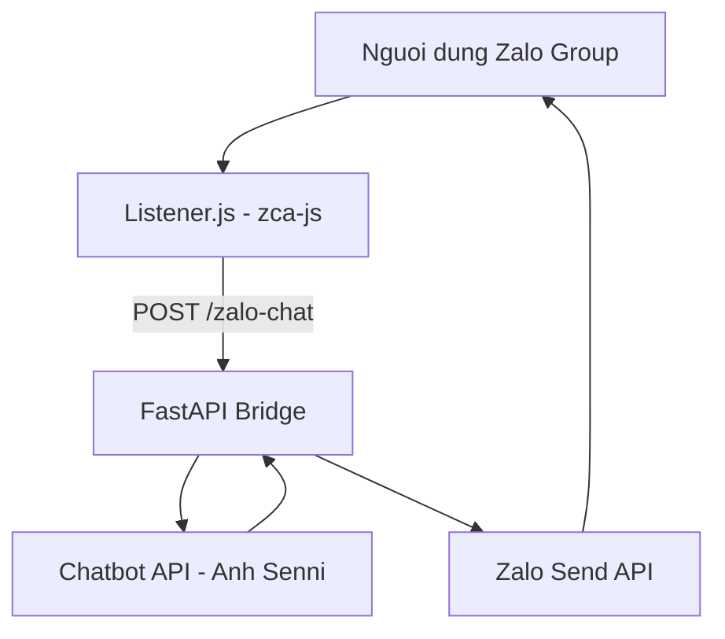

# Zalo AI Bridge - Hệ thống tích hợp AI Chatbot vào Zalo Group

Dự án này cung cấp một giải pháp "Bridge" (Cầu nối) mạnh mẽ, cho phép tích hợp bất kỳ AI Chatbot nào vào Zalo Group thông qua tài khoản cá nhân (đóng vai trò listener) và Zalo Send API (đóng vai trò sender).

> [!WARNING]  
> **Dự án sử dụng thư viện không chính thức (Unofficial API) để tương tác với Zalo.**  
> Chỉ nên dùng cho mục đích học tập, nghiên cứu và demo nội bộ. Việc sử dụng cho mục đích thương mại quy mô lớn có thể dẫn đến rủi ro bị khóa tài khoản Zalo.

## Cong nghe su dung
- **Zalo Listener**: Sử dụng thư viện [zca-js](https://github.com/mra-9/zca-js) - Một bộ công cụ mã nguồn mở tuyệt vời để tương tác với Zalo.
- **AI Chatbot Infrastructure**: Hạ tầng Chatbot API và hệ thống gửi tin nhắn Zalo được phát triển và vận hành bởi **anh Senni** (Sennivn).
- **FastAPI Bridge**: Xây dựng bằng Python để điều phối và quản lý phiên (session) người dùng.

## Tinh nang noi bat
- **Personalized Memory**: Mỗi người dùng trong group có một bộ nhớ (session) riêng biệt dựa trên group_id và user_id.
- **Hybrid Architecture**: Sự kết hợp hoàn hảo giữa Node.js (hiệu năng cao cho listener) và Python/FastAPI (linh hoạt cho xử lý logic/AI).
- **Smart Filtering**: 
    - Chỉ phản hồi khi có lệnh /ai (không phân biệt hoa thường).
    - Tự động lọc các thông báo lỗi kỹ thuật, không spam vào Group.
- **Robustness**: Cơ chế tự động thử lại (Retry) khi gửi tin nhắn Zalo thất bại.
- **Security**: Bảo vệ endpoint bằng X-Bridge-Key.
- **Restricted Scope**: Giới hạn hoạt động trong đúng Group ID được cấu hình để đảm bảo an toàn khi demo.

## So do hoat dong



## Huong dan cai dat

### 1. Yeu cau he thong
- Python 3.10+
- Node.js 18+

### 2. Cai dat Python (Brain)
```bash
# Tạo môi trường ảo (khuyên dùng)
conda create -n zalo python=3.10
conda activate zalo

# Cài đặt thư viện
pip install fastapi==0.116.1 uvicorn[standard]==0.35.0 requests==2.32.4 python-dotenv==1.1.1 pydantic==2.11.7
```

### 3. Cai dat Node.js (Listener)
```bash
npm install zca-js node-fetch@2 dotenv
```

### 4. Cau hinh moi truong (.env)
Tạo file .env và điền đầy đủ thông tin sau:
```env
CHATBOT_API=http://your-chatbot-api.com/chat
CHATBOT_API_KEY=your_api_key
ZALO_SEND_API=http://your-zalo-gateway.com/send-message
GROUP_ID=8378571720125437839
BRIDGE_API_KEY=SECRET_KEY_123
```

> [!IMPORTANT]  
> **Luu y ve Chatbot API:** Dự án này đóng vai trò là "Cầu nối" (Bridge). Phần xử lý ngôn ngữ và phản hồi được thực hiện thông qua hệ thống Chatbot API do anh Senni cung cấp. Bạn cần được cấp quyền truy cập từ hệ thống của anh ấy để sử dụng.

## Cach van hanh

Hệ thống cần chạy song song 2 thành phần:

1. **Khoi dong Nao bo (Python):**
   ```bash
   uvicorn test:app --reload
   ```

2. **Khoi dong Tai nghe (Node.js):**
   ```bash
   node listener.js
   ```
   *Lưu ý: Quét mã QR hiện ra để đăng nhập vào tài khoản Zalo dùng để lắng nghe.*

## Cach su dung trong Zalo
Vào Group đã cấu hình, gõ lệnh theo cú pháp:
/ai [Cau hoi cua ban]

Ví dụ: /ai Chào bot, hôm nay có bao nhiêu vi phạm?

---
**Author:** Chí Hải  
**Repo:** [Hainguyen752004/bimatnho](https://github.com/Hainguyen752004/bimatnho)
